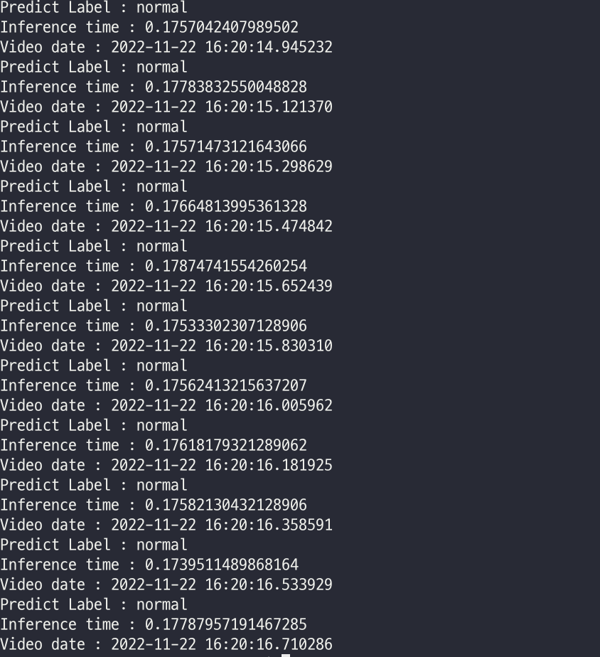
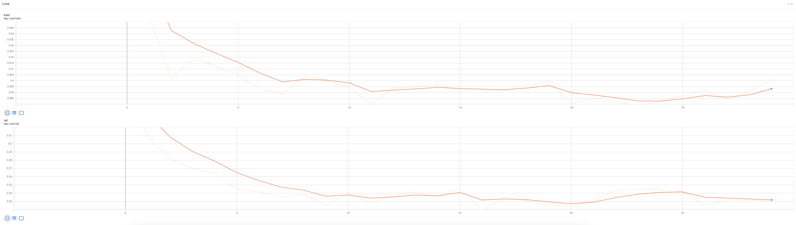
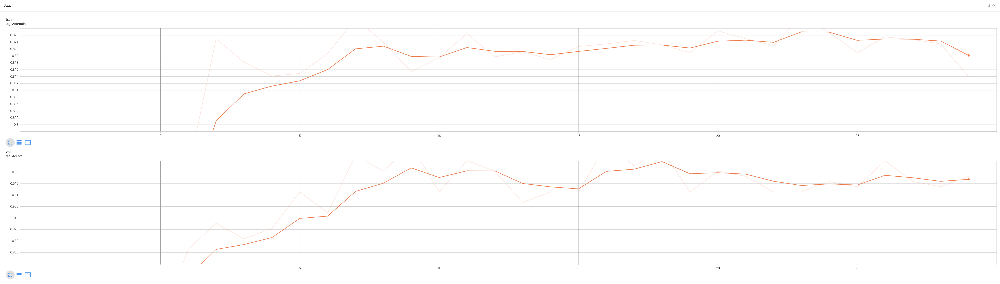

# INHA CASTONE PROJECT (AI part)

---
## 1. Overview
This reposiory is for **Inha university capstone**.

Project purpose is detecting abnormal situation in University (Train dataset is Inha university video)

Backbone network is [Efficientnet](https://arxiv.org/abs/1905.11946) -b7 model
## 2. Directory Structure
```
inha_capstone
    ├── sample_data : source video or image folder
    ├── weight : weight's folder
    ├── classifier.py : classifier code for test
    ├── dataloader.py : preprocess code for input data
    ├── inference.py : inference class code
    ├── main.py
    ├── test.py : test class
    └── classifier.py : classifier code for test
```
## 3. How to run?
1. Change **image_path** or **video_path** in **main.py**
2. Enter below command
```
python3 main.py
```
### Result


## 4. Performance
### 4.1. Train



Best validation acc is **92.46%**

### 4.2. Test
Total acc : **93.6**

0 (Abnormal) : **95%**

1 (Normal) : **92.2%**

Check **"experiment_efficientnet.xlsx"** file